# aws-three-tier-web-app
A production-ready, highly available three-tier web application built on AWS.

# AWS Three-Tier Web Application

## 📖 The Project Story

This repository documents my journey of building a production-ready, highly available three-tier web application on AWS. This is **Project #2** from the guide ["5 AWS Projects To Get You Hired"](https://learn.thecloudengineers.com/5-aws-projects-to-get-you-hired) by Lefteris Karageorgiou.

The goal is to demonstrate hands-on skills with core AWS services, networking, and architectural best practices that are essential for a cloud role.

---

## 🏗️ Architecture

```mermaid
graph TB
    %% === HIGH CONTRAST COLORS FOR DARK BACKGROUND ===
    classDef blue fill:#1e40af,stroke:#3b82f6,color:#ffffff
    classDef red fill:#b91c1c,stroke:#dc2626,color:#ffffff  
    classDef green fill:#047857,stroke:#059669,color:#ffffff
    classDef purple fill:#7e22ce,stroke:#9333ea,color:#ffffff
    classDef orange fill:#c2410c,stroke:#ea580c,color:#ffffff

    %% === ARCHITECTURE COMPONENTS ===
    USERS[🌐 Internet Users]
    
    ALB[Application Load Balancer<br/>Presentation Tier]
    
    EC2_A[EC2 Instance #1<br/>Apache + PHP]
    EC2_B[EC2 Instance #2<br/>Apache + PHP]
    
    RDS[(RDS MySQL<br/>Data Tier)]
    
    SG_ALB[🛡️ ALB Security Group]
    SG_APP[🛡️ App Security Group] 
    SG_DB[🛡️ DB Security Group]

    %% === CONNECTIONS ===
    USERS --> ALB
    ALB --> EC2_A
    ALB --> EC2_B
    EC2_A --> RDS
    EC2_B --> RDS
    
    ALB -.-> SG_ALB
    EC2_A -.-> SG_APP
    EC2_B -.-> SG_APP
    RDS -.-> SG_DB

    %% === APPLY STYLES ===
    class USERS blue
    class ALB red
    class EC2_A,EC2_B green
    class RDS purple
    class SG_ALB,SG_APP,SG_DB orange
```

The application consists of three distinct layers:
- **Presentation Tier:** Public-facing Application Load Balancer (ALB) and web servers.
- **Application Tier:** EC2 instances in private subnets, managed by an Auto Scaling Group (ASG).
- **Data Tier:** Amazon RDS (PostgreSQL/MySQL) instance in a private subnet for data persistence.

The entire infrastructure is deployed within a custom VPC across multiple Availability Zones for high availability.

---

## 🚀 Implementation Progress

This is my live progress tracker. I am building this step-by-step.

| Phase | Status | Date Completed | Notes & Learnings |
| :--- | :---: | :---: | :--- |
| **Phase 0: Project Setup** | ✅ | 21/11/2025 | Set up GitHub repository and project documentation. Ready to start building in AWS! |
| **Phase 1: Network Foundation** | ✅ | 21/11/2025 | Successfully created VPC with CIDR 10.0.0.0/16, spanning 2 AZs with 2 public and 4 private subnets. All route tables, Internet Gateway, and NAT Gateway configured automatically. |
| **Phase 2: Security Configuration** | ✅ | 21/11/2025 | Created three security groups following least privilege: ALB allows HTTP/S from internet, App tier only allows HTTP from ALB, Database only allows DB port from App tier. Defense-in-depth established! |
| **Phase 3: Data Tier Setup** | ✅ | 21/11/2025 | Launched RDS MySQL/PostgreSQL instance in private subnets with no public access. Database security group properly configured to only allow connections from application tier. |
| **Phase 4: Application Tier Setup** | ✅ | 23/11/2025 | First EC2 instance (ip-10-0-130-102) fully operational with Apache + PHP + MySQL connectivity. Database and visitors table created successfully. |
| **Phase 4: Application Tier Setup** | ✅ | 23/11/2025 | Both EC2 instances fully operational! Fixed PHP processing on second instance. Both instances successfully connecting to RDS MySQL database and serving web applications. |
| **Phase 5: Presentation Tier Setup** | ✅ | 23/11/2025 | Application Load Balancer configured and active. Target group includes both healthy EC2 instances. Three-tier architecture complete! |
| **Phase 6: Final Validation** | ✅ | 23/11/2025 | **LIVE!** Three-tier application accessible via Load Balancer DNS. Load balancing verified between instances. |

---

## 🛠️ Technologies & AWS Services Used

- **Compute:** Amazon EC2, Auto Scaling
- **Networking:** Amazon VPC, Application Load Balancer, Internet Gateway, NAT Gateway
- **Database:** Amazon RDS (MySQL)
- **Security:** Security Groups, IAM Roles
- **Web Stack:** Apache HTTP Server, PHP, MySQLi

---

## 📂 Repository Structure
├── README.md # You are here! The project story and guide.

├── diagrams/ # Architecture diagrams

├── infrastructure/ # (Future) IaC code (Terraform/CDK/CloudFormation)

└── application-code/ # (Future) Sample application code for the EC2 instances

---

## 🎯 Key Skills Demonstrated

- Three-tier architecture design and implementation
- VPC networking with public and private subnets
- Security group configuration and defense-in-depth
- Load balancer setup and traffic distribution
- Database deployment and connectivity
- Troubleshooting and problem-solving in cloud environments

## 🌟 Lessons Learned

1. **Regional Consistency**: EC2 instances and RDS must be in the same region for proper VPC networking
2. **Security Groups**: Critical for controlling traffic flow between tiers
3. **PHP Configuration**: mod_php vs PHP-FPM differences and troubleshooting
4. **Load Balancer Health Checks**: Essential for proper traffic distribution
5. **Persistence Pays Off**: Cloud engineering requires systematic troubleshooting
